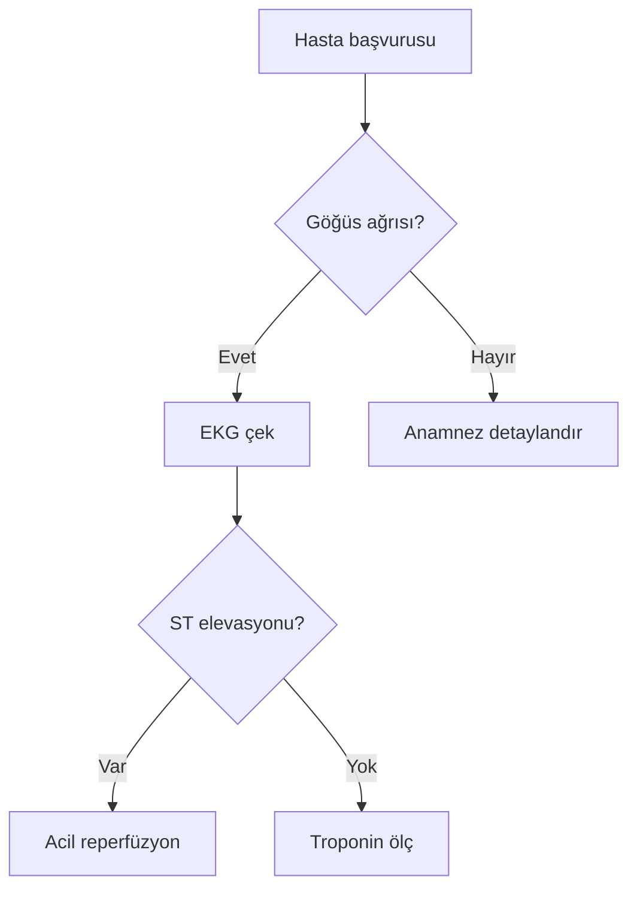

# İçerik Ekleme Rehberi — omuratakanates.com

Bu dosya: siteye nasıl yeni yazı (veya infografik) eklenir, adım adım.

---

## 🚀 İki yöntem var — siz seçin

### Yöntem A: Tarayıcıdan, GitHub web arayüzü ile (en kolay, kurulum yok)

Telefondan bile yazı ekleyebilirsiniz. Hiç yazılım kurmanız gerekmiyor.

### Yöntem B: Bilgisayardan, metin editörü ile (uzun yazılar için ideal)

Önizleme yapabilir, hataları anında görürsünüz. Bir kez kurulum gerektirir.

---

## ✅ Yöntem A: GitHub web arayüzünden yazı eklemek

### 1. GitHub'a girin
https://github.com/droatakanates/omuratakanates

### 2. Doğru klasöre gidin
Hangi bölüme yazı ekleyeceğinize göre:

| Bölüm | Klasör yolu |
|---|---|
| İç Hastalıkları | `src/content/ic-hastaliklari/` |
| Sağlık Rehberi | `src/content/saglik-rehberi/` |
| Siyaset Bilimi | `src/content/siyaset/` |

Yukarıda gösterilen yolu sırayla tıklayarak ilerleyin (`src` → `content` → ilgili bölüm).

### 3. Yeni dosya oluşturun
Sağ üstte **"Add file"** → **"+ Create new file"**

### 4. Dosya adını yazın
**Sadece ASCII (Türkçe karakter yok), küçük harf, kelimeler arası tire**:
- ✓ `diyabet-tani-kriterleri.md`
- ✓ `tansiyon-olcumu.md`
- ✗ `Diyabet Tanı Kriterleri.md`
- ✗ `hipertansiyon_yönetimi.md`

Dosya uzantısı **`.md`** olmalı (markdown).

### 5. İçeriği yapıştırın
`şablonlar/` klasöründeki uygun şablondan kopyalayıp yapıştırın:
- İç Hastalıkları için: `şablonlar/01-yazi-sablonu-ic-hastaliklari.md`
- Sağlık Rehberi için: `şablonlar/02-yazi-sablonu-saglik-rehberi.md`
- Siyaset için: `şablonlar/03-yazi-sablonu-siyaset.md`
- İnfografik için: `şablonlar/04-yazi-sablonu-infografik.md`

Şablonu dosyaya yapıştırın, sonra başlık/içerik/kategori vb. alanları kendi yazınızla doldurun.

### 6. Commit edin
Sayfanın altında **"Commit changes"** butonu var, basın.
- **Commit message** otomatik dolu gelir, isterseniz değiştirin
- **"Commit directly to the main branch"** seçili kalsın
- Yeşil **"Commit changes"** butonuna basın

### 7. Yayına bekleyin
Netlify push'u görür ve **1-2 dakika içinde** yeni yazınız `https://omuratakanates.com/...` adresinde canlı olur.

---

## ✅ Yöntem B: Bilgisayarda metin editörü ile

### Kurulum (bir defalık)

1. **Visual Studio Code** indirin: https://code.visualstudio.com (ücretsiz, en yaygını)
2. VS Code'u açın → **File > Open Folder** → `İçHastalıklarıWebSitesi` klasörünü açın
3. Sol panel **Explorer**'da tüm projeyi görürsünüz

### Yeni yazı eklemek

1. Sol panelde **`src/content/ic-hastaliklari/`** (veya gideceği bölüm) klasörünü açın
2. Klasör adına sağ tık → **New File** → adını yazın (örn. `yeni-yazi.md`)
3. `şablonlar/` klasöründen şablonu açıp kopyalayın, yeni dosyaya yapıştırın
4. Yazıyı yazın
5. Lokal önizleme isterseniz: VS Code Terminal'ini açın (Terminal > New Terminal), şunu çalıştırın:
   ```
   npm run dev
   ```
   Tarayıcıda `http://localhost:4321` açın, değişiklikleri anında görürsünüz.
6. Tamamlandığında **GitHub Desktop**'ı açın → Commit → Push

---

## 🖼️ İnfografik (sadece görsel) yazılar için özel notlar

Bazı yazılarınız sadece infografikten oluşacak (hiç düz yazı yok). Yapın:

### 1. Görseli hazırlayın
- Format: PNG veya JPG
- Genişlik: 1024–2000 piksel
- Dosya adı: küçük harf, tireli, Türkçe karaktersiz (örn. `tansiyon-akilli-takip.png`)

### 2. Görseli yükleyin

**Yöntem A — GitHub web:**
- GitHub'da repo'nuza girin → `public/gorseller/` klasörüne girin
- **"Add file" → "Upload files"** → görseli sürükle bırak
- **Commit changes**

**Yöntem B — VS Code:**
- Görseli `public/gorseller/` klasörüne kopyalayın
- GitHub Desktop'tan commit + push

### 3. Markdown yazısını oluşturun

Şablon: `şablonlar/04-yazi-sablonu-infografik.md`

İçerik kısmı sadece şunu içerebilir:

```markdown

```

Veya daha geniş istiyorsanız:

```html
<figure class="infographic">
  
  <figcaption>Şekil 1: Evde tansiyon ölçümünün adımları.</figcaption>
</figure>
```

Frontmatter (başlık, açıklama, kategori, tarih) yine **zorunludur** — yazı kartında ve SEO'da kullanılır.

---

## 📋 Frontmatter alanları (her yazının başındaki `---` arası kısım)

### Ortak (her bölüm için)

| Alan | Zorunlu? | Açıklama |
|---|---|---|
| `title` | ✓ | Yazı başlığı |
| `description` | ✓ | 1-2 cümlelik özet (max 200 karakter) |
| `publishDate` | ✓ | YYYY-MM-DD formatında |
| `category` | ✓ | Bkz. her bölümün geçerli liste (şablonlarda var) |
| `tags` | — | `["etiket1", "etiket2"]` |
| `references` | — | Kaynaklar (her satır bir kaynak) |
| `draft` | — | `true` ise sitede görünmez (yayın öncesi taslak için) |
| `updatedDate` | — | Güncellendiğinde tarihi |

### Yalnızca İç Hastalıkları için ek alanlar

| Alan | Açıklama |
|---|---|
| `evidenceLevel` | `A`, `B`, `C`, `D` veya `Uzman Görüşü` |
| `icerikTipi` | Olgu Sunumu / Literatür Özeti / Klinik Pratik / Kılavuz Özeti / TUS-YDUS / Asistan Köşesi |

### Yalnızca Sağlık Rehberi için ek alan

| Alan | Açıklama |
|---|---|
| `okumaSuresi` | "3 dk", "5 dk" gibi |

---

## 🧪 Test ipuçları

### Taslak (yayınlanmasın) modu
Yazınız hazır olmadan önce `draft: true` koyarsanız sitede görünmez. Bitirince `false` yapın.

### Yazıyı geçici olarak gizlemek
Aynı yöntem: `draft: true` ekleyin, commit edin.

### Bir yazıyı silmek
GitHub'da dosyayı açın → sağ üstte çöp kovası ikonu → **Commit changes**. Site 1-2 dk içinde güncellenir.

### Bir kategoriyi değiştirmek
`src/content.config.ts` dosyasında listeleri düzenleyebilirsiniz. Yeni kategori eklediğinizde tüm yazılarda kullanılabilir.

---

## ❓ Sorun çıkarsa

### "Build failed" e-postası gelirse Netlify'dan

1. Genelde **frontmatter hatası**: kategori yazılışı yanlış, tarih biçimi hatalı, eksik bir alan
2. Netlify'da Deploys sekmesine girin → kırmızı build'e tıklayın → **"Build log"**
3. Genelde son satırlarda hata net yazar (örn. `Invalid enum value: Endokrionoloji`)
4. Hatayı düzeltip yeni commit yapın

### Görsel görünmüyor

- Yol başında **`/`** var mı? (`/gorseller/foo.png` ✓ — `gorseller/foo.png` ✗)
- Dosya adı **tam olarak** doğru mu? (büyük/küçük harf önemli)
- Görsel gerçekten `public/gorseller/` içinde mi?

### Türkçe karakterler bozuk görünüyor

- Editörünüz dosyayı UTF-8 olarak kaydetmeli (VS Code varsayılan olarak UTF-8)
- GitHub web arayüzü zaten UTF-8 kullanır, sorun olmaz

---

## 🖼️ Kapak görseli (cover image)

Her yazı için opsiyonel bir kapak görseli ekleyebilirsiniz. Gözüktüğü yerler:
- Yazı sayfasının üstünde (21:9 büyük banner)
- Yazı kartlarında (anasayfada + bölüm sayfasında thumbnail olarak)
- Sosyal medya paylaşımında (WhatsApp, Twitter/X) önizleme görseli

**Pages CMS'te eklemek için:** "Kapak Görseli" alanına resim butonundan yükleyin. **Alt metin** alanını da doldurun (SEO + erişilebilirlik).

**Markdown frontmatter'da elle eklemek için:**
```yaml
coverImage: /gorseller/diyabet-kapak.jpg
coverImageAlt: Diyabette ayak bakımı temalı kapak görseli
```

İdeal boyut: 1600×900 px (16:9), 200-400 KB.

---

## 📣 Callout (uyarı/bilgi kutuları)

Yazının içinde renkli, dikkat çekici kutular oluşturabilirsiniz. 5 tür:

- **info** (mavi) — bilgilendirme
- **tip** (yeşil) — pratik ipucu
- **warning** (sarı) — dikkat edilecek nokta
- **danger** (kırmızı) — kritik uyarı
- **success** (yeşil) — başarı / sonuç

**Pages CMS'te eklemek için** kaynak (markdown) moduna geçip yapıştırın:

```html
<aside class="callout callout--warning">
  <div class="callout__icon">⚠</div>
  <div class="callout__body">
    <p class="callout__title">Dikkat</p>
    <div class="callout__content">
      Bu ilaç böbrek yetmezliği olan hastalarda doz ayarı gerektirir.
    </div>
  </div>
</aside>
```

Türü değiştirmek için `callout--warning` yerine `callout--info`, `callout--tip`, `callout--danger` veya `callout--success` yazın. İkon (⚠) ve başlık (Dikkat) içeriği serbest.

---

## 📊 Mermaid diyagramları (akış şeması / algoritma)

Tıbbi karar algoritmaları, akış şemaları için ideal. Markdown içinde kod bloğu olarak yazarsınız, tarayıcıda otomatik diyagrama dönüşür.

**Pages CMS kaynak modunda yazın:**

````markdown

````

Şema türleri: `flowchart`, `sequenceDiagram`, `classDiagram`, `gantt`, `pie`, `mindmap`, vb. Detaylı söz dizimi: https://mermaid.js.org/intro/

Mermaid scripti **sadece sayfada mermaid bloğu varsa** yüklenir, bu yüzden diğer sayfalar yavaşlamaz.

---

## 🎯 Hızlı başvuru — sık yapılan işler

| Yapmak istediğim | Adım |
|---|---|
| Yeni İç Hastalıkları yazısı | GitHub → `src/content/ic-hastaliklari/` → Add file → şablonu yapıştır |
| Yeni Sağlık Rehberi yazısı | GitHub → `src/content/saglik-rehberi/` → Add file → şablonu yapıştır |
| Yeni Siyaset yazısı | GitHub → `src/content/siyaset/` → Add file → şablonu yapıştır |
| İnfografik eklemek | Görseli `public/gorseller/`'a yükle → ilgili bölümün klasöründe md dosyası oluştur |
| Yazıyı düzenlemek | Dosyayı GitHub'da aç → kalem ikonu → değişikliği commit et |
| Yazıyı silmek | Dosyayı GitHub'da aç → çöp ikonu → commit |
| Telefon/e-posta değiştirmek | `src/pages/iletisim.astro` |
| Hakkımda yazısını değiştirmek | `src/pages/hakkimda.astro` |
| Kategori eklemek | `src/content.config.ts` |
